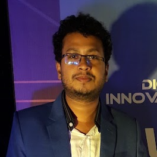

# Md. Maruf Howlader

## Contact Information

- **Location:** 118, 2nd Floor, New Paltan, Azimpur New Market, Dhaka, PO 1205
- **Mobile:** +8801714489719, +8801571772973
- **Email:** maruf.dhaka2010@gmail.com
- **Portfolio:** [https://gitopu.github.io](https://gitopu.github.io)
- **GitHub:** [https://github.com/gitOpu](https://github.com/gitOpu)

## Career Objective

A professional with a blend of technical expertise, creative insight, and strong analytical abilities aiming to leverage knowledge in crafting immersive and interactive gaming experiences. As a passionate Unity Developer, the goal is to contribute innovative game mechanics and compelling narratives to a forward-thinking development team.

## Employment History

### Experience 1: [Brain Station 23](https://brainstation-23.com)
> Brain Station 23 Limited is a homegrown software development company providing state-of-the-art software & IT solutions for both locally & globally, has successfully completed 2000+ projects.

- **Role:** Software Engineer (Game Developer)
- **Duration:** February 2022 - Present
- **Responsibilities:**
    - Programing and implement gameplay system as per level design, ensuring a seamless and engaging player experience.
    - Follow up team player’s jobs and review code on GitHub, suggested optimize game script for performance enhancements and helps to problem solving, fixing issues to ensure smooth gameplay across different platform and device like Desktop, Mobile, Xbox, Oculus Quest etc.
    - Mentor junior developers, collaborate with cross functional teams like level designer, artists, animator, audio engineer to ensure cohesive game development.
    - Stay updated with the latest gaming trends and technologies, integrating them into projects to keep the games innovative and competitive.
    - Provide significant input in the game design process, storyboarding, gameplay mechanics and user experience
    - Prepare technical documentation for codebase for future reference and scalability. Maintenance project management scrum like Jira, Trello, Loop, ensuring that development milestones and deadlines are met with the qualities.
    - Experience have on game post-processing like visual tuning, lighting adjustments, and customizing the render pipeline.

    [Brain Station 23](https://brainstation-23.com) | [Studio 23](https://studio-23.xyz)

### Experience 2: [Playense](https://playense.com)
> Playense is a hyper-casual game development studio with 60+ games released across Google Play and Apple App Store.

- **Role:** Assistant Game Engineer (Unity Developer)
- **Duration:** January 2021 - January 2022
- **Responsibilities:**
    - Create prototypes from internal concepts
    - Develop and implement game features for mobile devices, ensuring they are optimized for touch interfaces and mobile hardware specifications
    - Analyze mobile game trends, features and mechanics, 
    - Implement different type of Ad Api services like google AdMob, Vungle, Unity Ads etc.
    - Work with analytics services like Yandex Metrica,  AppsFlyer etc.
    - Work as team members with collaboration large, existing game projects.
    - Work closely with product manager, game designers and artists to ensure that the game's design as per client requirements 

    [Playense](https://playense.com)

### Experience 3: [Creative Young Limited](http://creativeyoung.org)
> Creative Young Ltd. is one of the growing Software Development Firm in Bangladesh. Mostly its works for mobile apps development. 

- **Role:** Developer (iOS)
- **Duration:** July 2020 - December 2021
- **Responsibilities:**
  - Creating prototypes and designing and building applications for the iOS platform.
  - Ensuring the performance, quality, and responsiveness of applications.
  - Identifying and correcting bottlenecks and fixing bugs.
  - Help maintain code quality, organization, and automatization

    [Creative Young Limited](http://creativeyoung.org)

### Experience 4: [Bangladesh Computer Samity (BCS)](https://bcs.org.bdhttps://bcs.org.bd)
> BCS is one of the largest ICT association in Bangladesh established 1987.

- **Role:** Program Officer (Web Developer, Graphics)
- **Duration:** May 2017 - June 2020
- **Responsibilities:**
  - Developing and implementing web (PHP, JS, MySql) and other applications.
  - Maintaining relationships between management and the technical team.
  - Updating and attaching new features to applications.
    
     [Bangladesh Computer Samity (BCS)](https://bcs.org.bdhttps://bcs.org.bd)
     
## Recent Projects

### [Silent Scream](https://store.steampowered.com/app/1955750/SILENT_SCREAM/) (PC Game)
- **Technologies Used:** Unity 3D, C#, HDRP, FMOD, XNODE, Unitask
- **Role:** Development support & porting
- **Description:** A game set in a Lovecraftian-themed world where you play as a fast-food restaurant worker facing a Junji Ito-inspired monster.

### [Control Override](https://store.steampowered.com/app/1406090/ControlOverride/) (PC Game)
- **Technologies Used:** Unity 2D, C#, URP, localization, yarnspinner, visualeffectgraph
- **Role:** Support and porting
- **Description:** A puzzle game where you must share control between the environment and yourself.

## Education

- **B.Sc in Mathematics**, Jagannath University, Dhaka (2014)
- **M.Sc in Mathematics**, Jagannath University, Dhaka (2015)

## Skills

- **Programming Languages:** C#, HTML, CSS, PHP, JS, JQuery
- **Tools & Technologies:** Unity, Xcode, Swift, GitHub, Jira, Trello
- **Design & Animation:** Blender, Adobe Illustrator, Adobe Photoshop

## Certifications & Training

- **iOS Apps & Design & Development** - LICT Project (ICT Division), Bhuyan IT, Dhanmondi, Dhaka (6 months)
- **Top up IT Training on C#, ASP .Net, Software Development** - Earnest Young  (ICT Division), Jagannath University, CSE Dept. Dhaka (6 months)
- **2D & 3D Animation and VFX** - KARJU Communication, Nikunja, Gulshan-1, Dhaka (6 months)

## Interpersonal Skills

- Efficient in effective communication and good public relations.
- Confident and friendly when meeting and assisting people at all levels.
- Strong analytical problem-solving and decision-making ability.
- Always interested in learning new things and have a positive attitude towards responsibilities.

---
Md. Maruf Howlader
